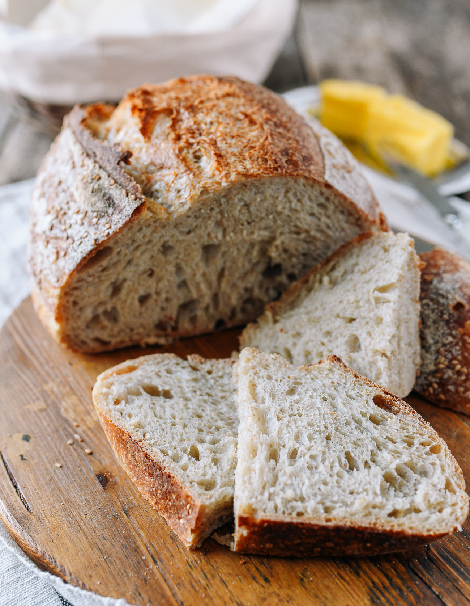

# Header1

*Italics* 
**Bold**
## Header 2
### Note 1:

- embed links contain text in [], link inside ()

[Sourdough Bread Wiki](https://en.wikipedia.org/wiki/Sourdough)

###Note 2:
-embed images start with !, alt text inside [], absolute link to img or name of file in repo inside ()

